# MCP-Go Architecture Documentation

## Overview

MCP-Go is a comprehensive Go implementation of the Model Context Protocol (MCP), designed to enable seamless integration between LLM applications and external data sources and tools. This document provides a detailed architectural overview of the codebase, including component relationships, data flow, and design patterns.

## Table of Contents

- [Architecture Overview](#architecture-overview)
- [Core Components](#core-components)
- [Transport Layer](#transport-layer)
- [Session Management](#session-management)
- [Protocol Implementation](#protocol-implementation)
- [Data Flow](#data-flow)
- [Design Patterns](#design-patterns)
- [Extension Points](#extension-points)

## Architecture Overview

The MCP-Go implementation follows a layered architecture with clear separation of concerns:

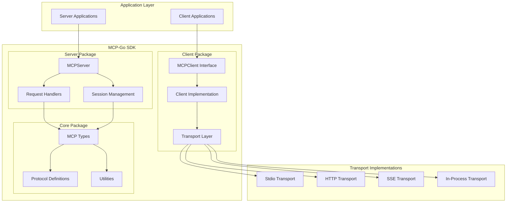

## Core Components

### 1. Client Package (`client/`)

The client package provides a unified interface for connecting to MCP servers across different transport mechanisms.

#### Key Components:

- **MCPClient Interface**: Defines the contract for all client implementations
- **Client Implementation**: Concrete implementation handling protocol communication
- **Transport Layer**: Abstracted transport mechanisms (stdio, HTTP, SSE, in-process)

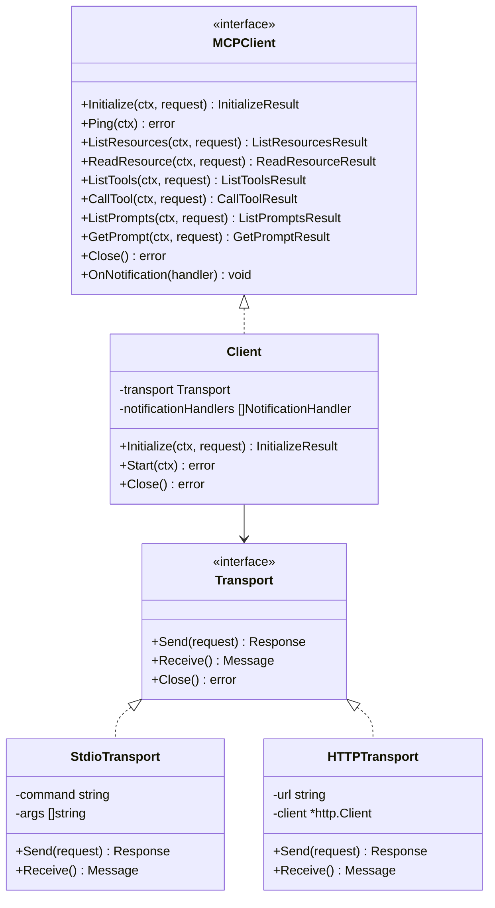

### 2. Server Package (`server/`)

The server package implements the MCP server with comprehensive capabilities for handling resources, tools, and prompts.

#### Key Components:

- **MCPServer**: Main server implementation
- **Request Handlers**: Protocol-specific request processing
- **Session Management**: Client session tracking and management
- **Capabilities Management**: Feature capability negotiation

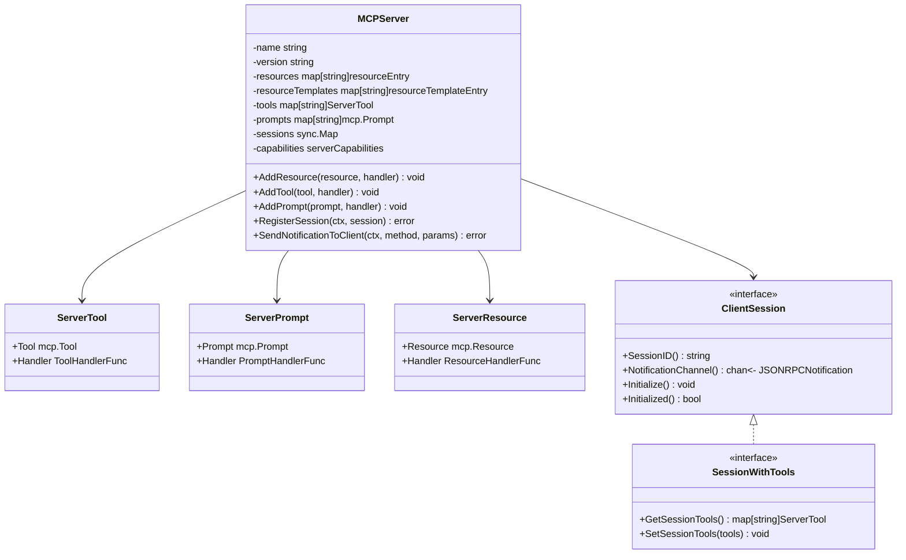

### 3. MCP Core Package (`mcp/`)

The core package contains the fundamental types, constants, and utilities for the MCP protocol implementation.

#### Key Components:

- **Types**: Core data structures for requests, responses, and protocol elements
- **Constants**: Protocol version, error codes, and method definitions
- **Utilities**: Helper functions for common operations

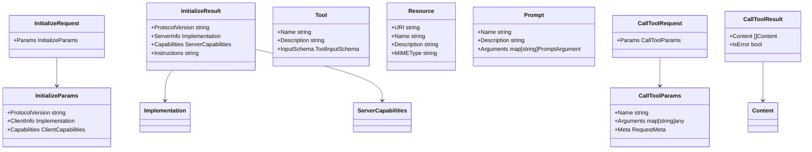

## Transport Layer

MCP-Go supports multiple transport mechanisms, each optimized for different use cases:

### Transport Architecture

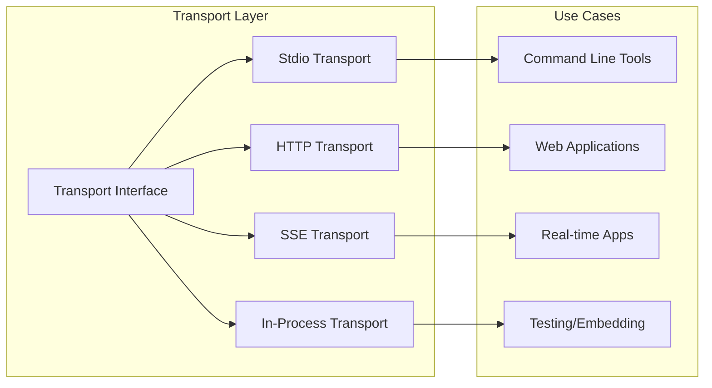

### Transport Implementations

1. **Stdio Transport**: Process-based communication via stdin/stdout
2. **HTTP Transport**: RESTful API over HTTP/HTTPS
3. **SSE Transport**: Server-Sent Events for real-time communication
4. **In-Process Transport**: Direct function calls for embedded scenarios

## Session Management

The server implements sophisticated session management for multi-client scenarios:

### Session Architecture

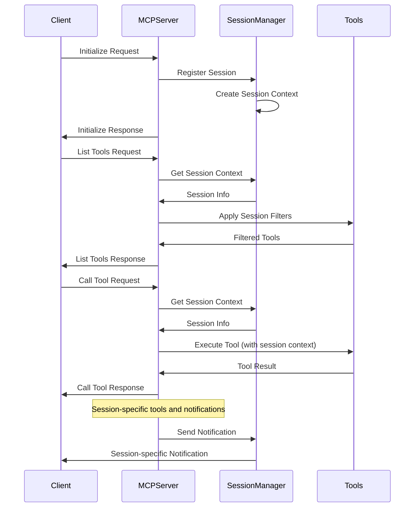

### Session Features

- **Per-Session State**: Isolated state for each client connection
- **Session-Specific Tools**: Dynamic tool registration per session
- **Tool Filtering**: Context-aware tool availability
- **Notification Routing**: Targeted notifications to specific sessions

## Protocol Implementation

The MCP protocol implementation follows the JSON-RPC 2.0 specification with MCP-specific extensions:

### Protocol Flow

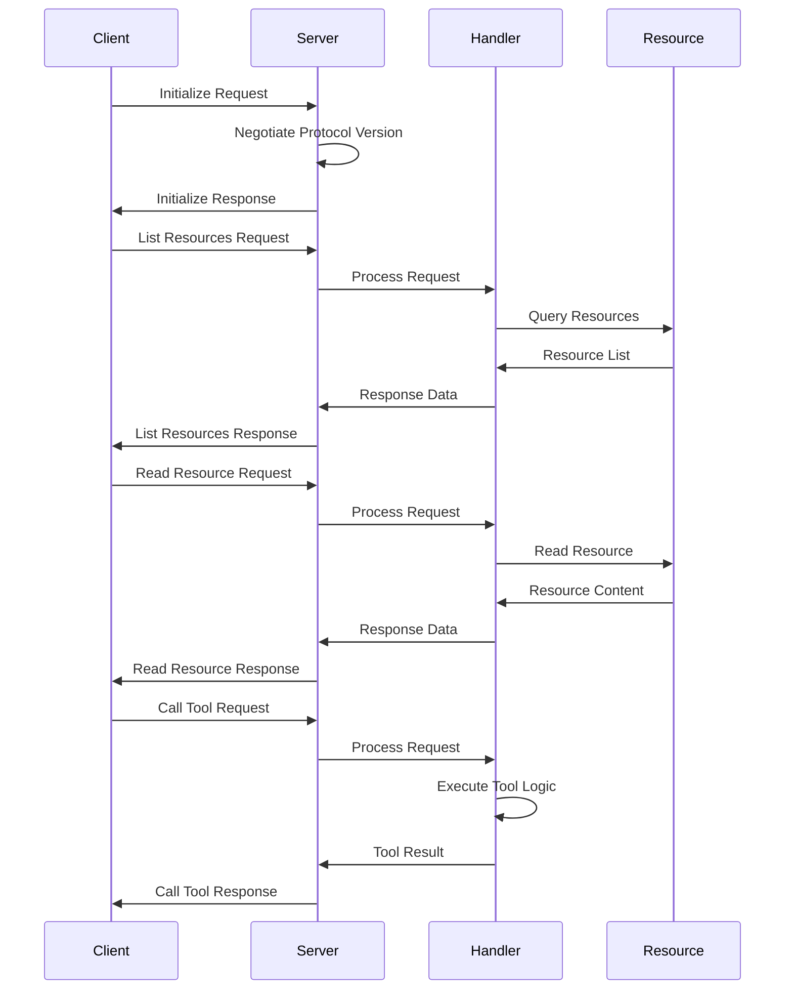

### Request Processing Pipeline

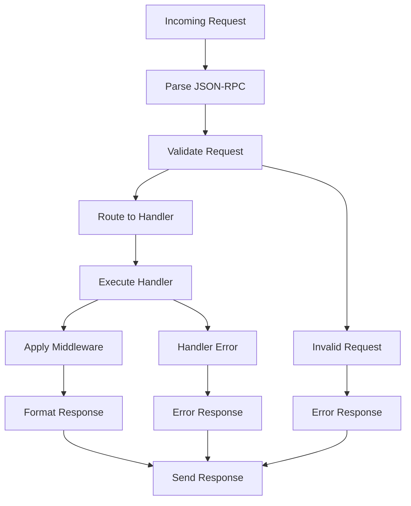

## Data Flow

### Client-Server Communication

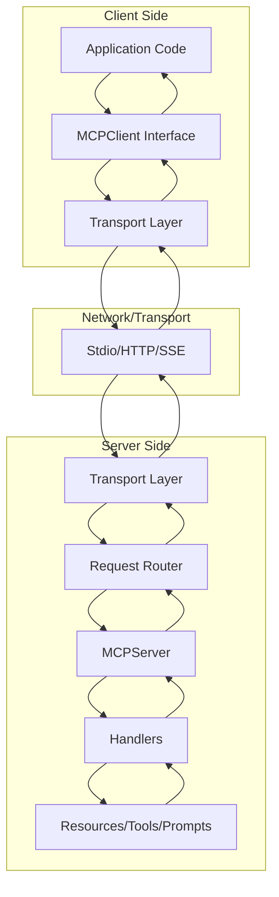

### Resource Access Flow

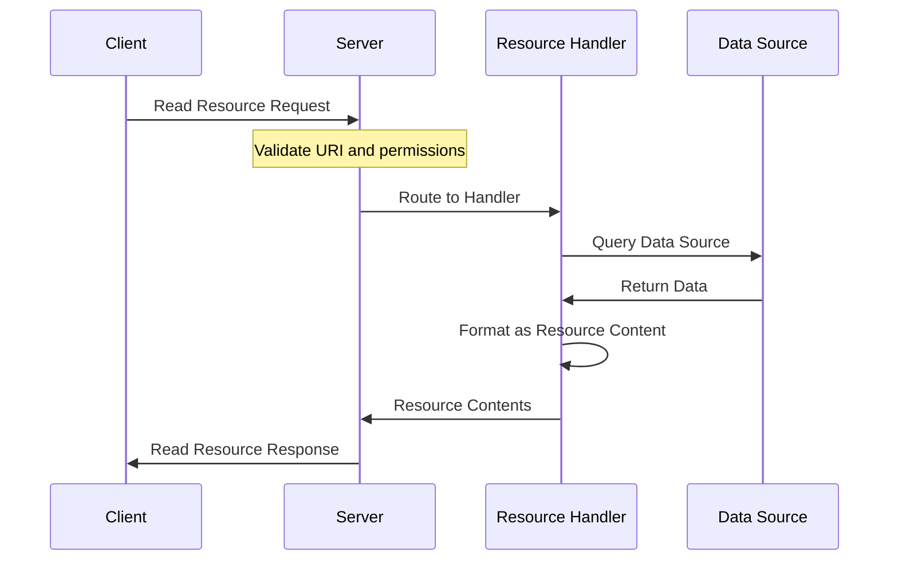

## Design Patterns

### 1. Strategy Pattern - Transport Layer

Different transport mechanisms are implemented as strategies:

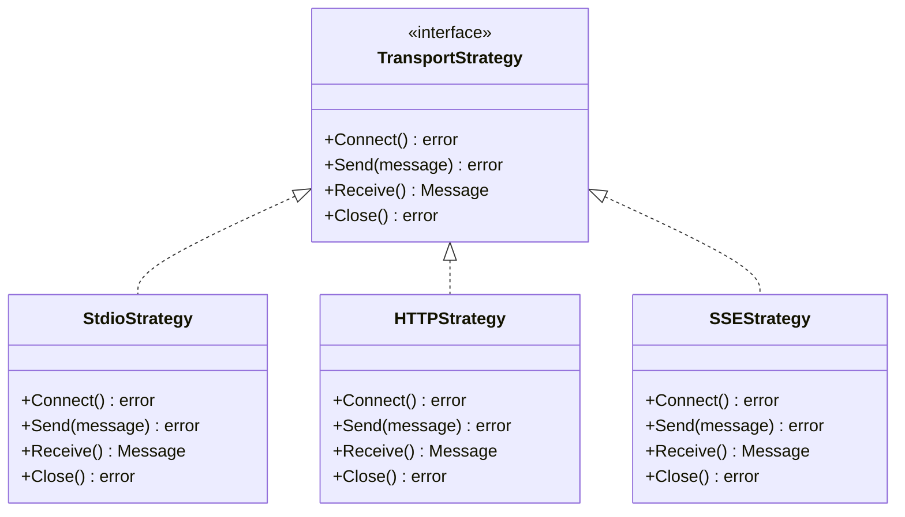

### 2. Observer Pattern - Notifications

The notification system uses the observer pattern for event handling:

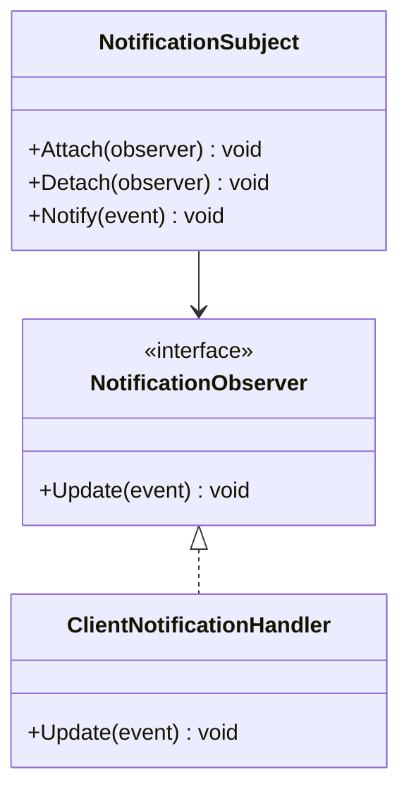

### 3. Middleware Pattern - Request Processing

Request processing uses middleware for cross-cutting concerns:

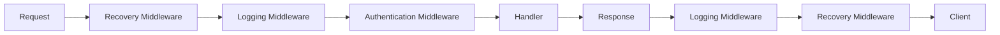

### 4. Factory Pattern - Resource Creation

Resources, tools, and prompts are created using builder patterns:

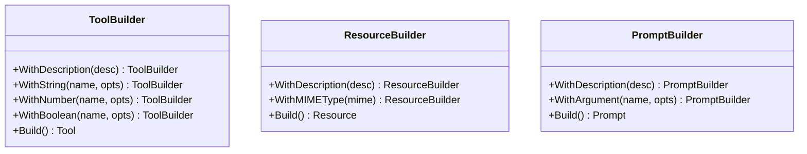

## Extension Points

### 1. Custom Transport Implementations

Developers can implement custom transport mechanisms by implementing the `Transport` interface:

```go
type CustomTransport struct {
    // Custom implementation
}

func (t *CustomTransport) Send(request JSONRPCMessage) error {
    // Custom send logic
}

func (t *CustomTransport) Receive() (JSONRPCMessage, error) {
    // Custom receive logic
}
```

### 2. Custom Session Types

Sessions can be extended with custom functionality:

```go
type CustomSession struct {
    // Embed base session
    *BaseSession
    // Custom fields
    UserID string
    Permissions []string
}

func (s *CustomSession) GetSessionTools() map[string]ServerTool {
    // Custom tool filtering logic
}
```

### 3. Middleware Extensions

Custom middleware can be added for cross-cutting concerns:

```go
func CustomMiddleware(next ToolHandlerFunc) ToolHandlerFunc {
    return func(ctx context.Context, request CallToolRequest) (*CallToolResult, error) {
        // Pre-processing
        result, err := next(ctx, request)
        // Post-processing
        return result, err
    }
}
```

### 4. Custom Handlers

Resource, tool, and prompt handlers can be customized:

```go
func CustomResourceHandler(ctx context.Context, request ReadResourceRequest) ([]ResourceContents, error) {
    // Custom resource handling logic
}
```

## Security Considerations

### 1. Input Validation

All inputs are validated according to JSON Schema specifications:

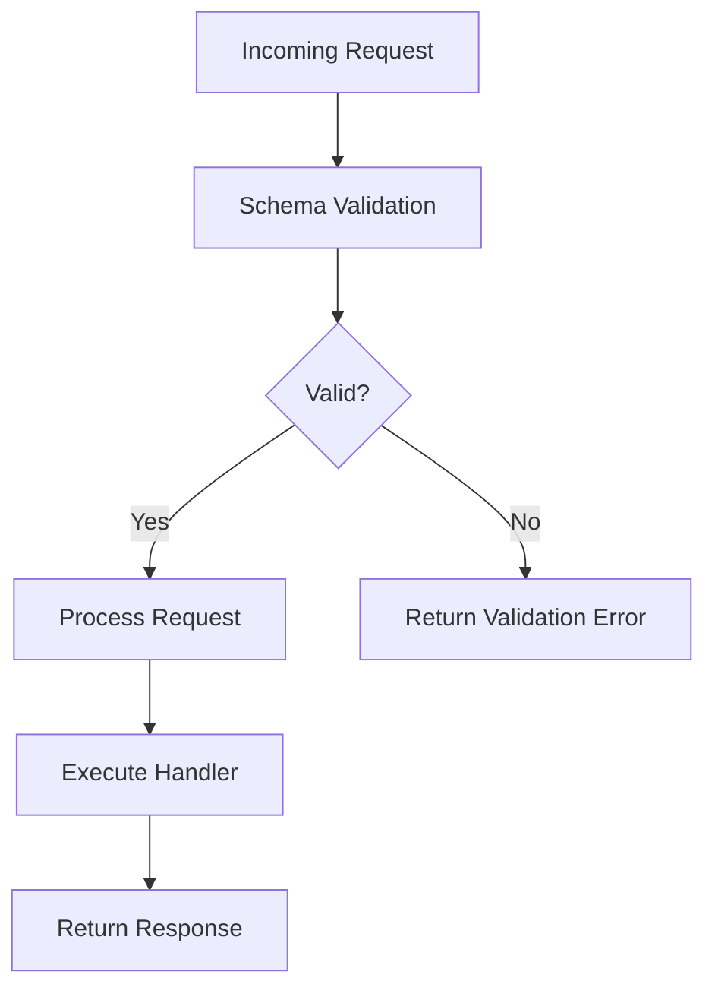

### 2. Session Isolation

Sessions are isolated to prevent cross-session data leakage:

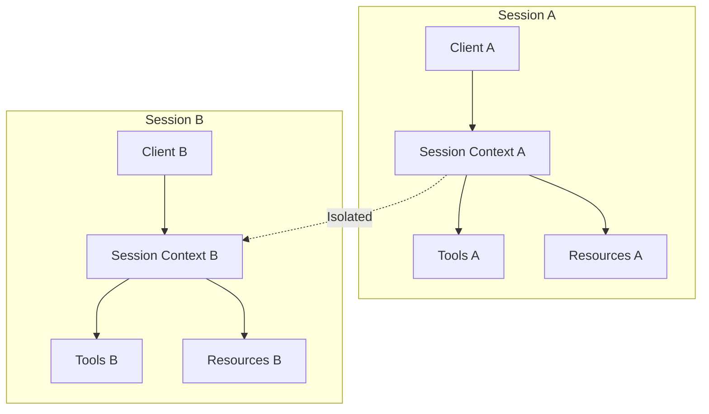

## Performance Considerations

### 1. Concurrent Request Handling

The server handles multiple concurrent requests efficiently:

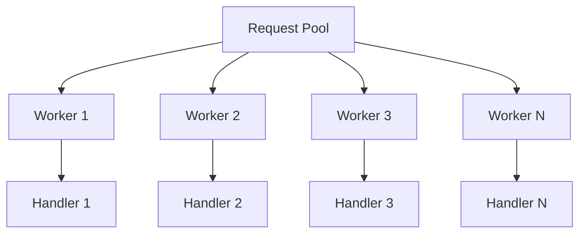

### 2. Resource Caching

Resources can be cached for improved performance:

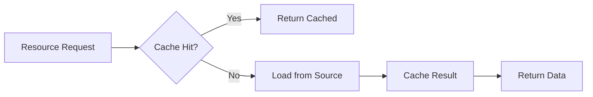

## Testing Strategy

### 1. Unit Testing

Each component is thoroughly unit tested:

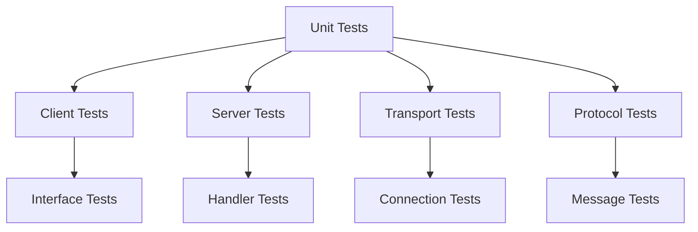

### 2. Integration Testing

End-to-end integration tests verify complete workflows:

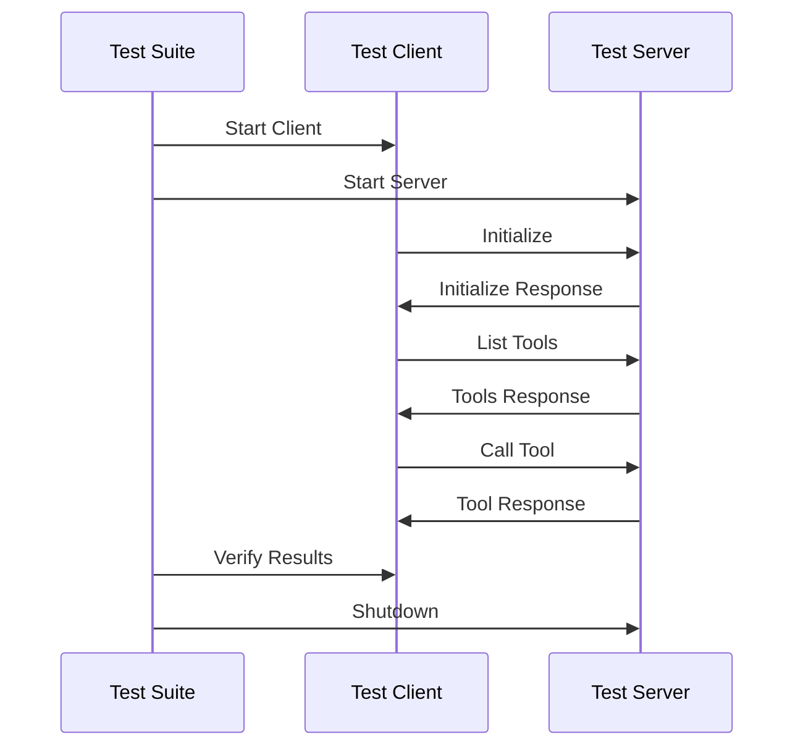

## Conclusion

MCP-Go provides a robust, extensible, and well-architected implementation of the Model Context Protocol. The layered architecture, comprehensive transport support, sophisticated session management, and extensive customization options make it suitable for a wide range of LLM integration scenarios.

The design emphasizes:
- **Modularity**: Clear separation of concerns across packages
- **Extensibility**: Multiple extension points for customization
- **Performance**: Efficient concurrent request handling
- **Reliability**: Comprehensive error handling and recovery
- **Security**: Input validation and session isolation
- **Testability**: Extensive test coverage and mocking support

This architecture enables developers to build sophisticated MCP servers and clients while maintaining clean, maintainable code and following Go best practices.